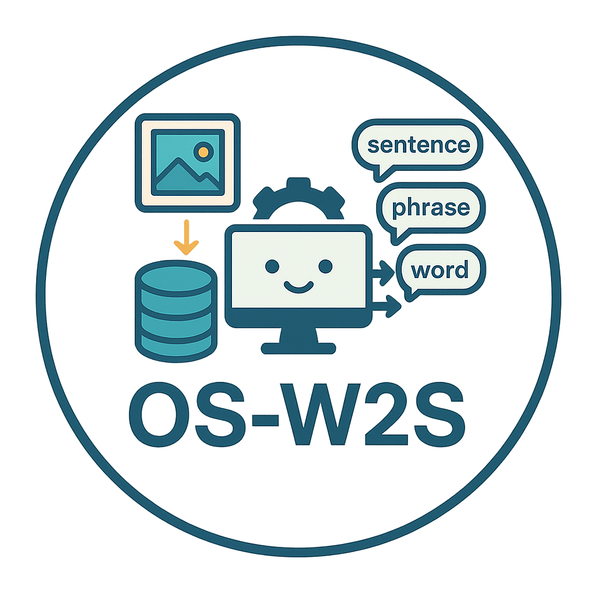
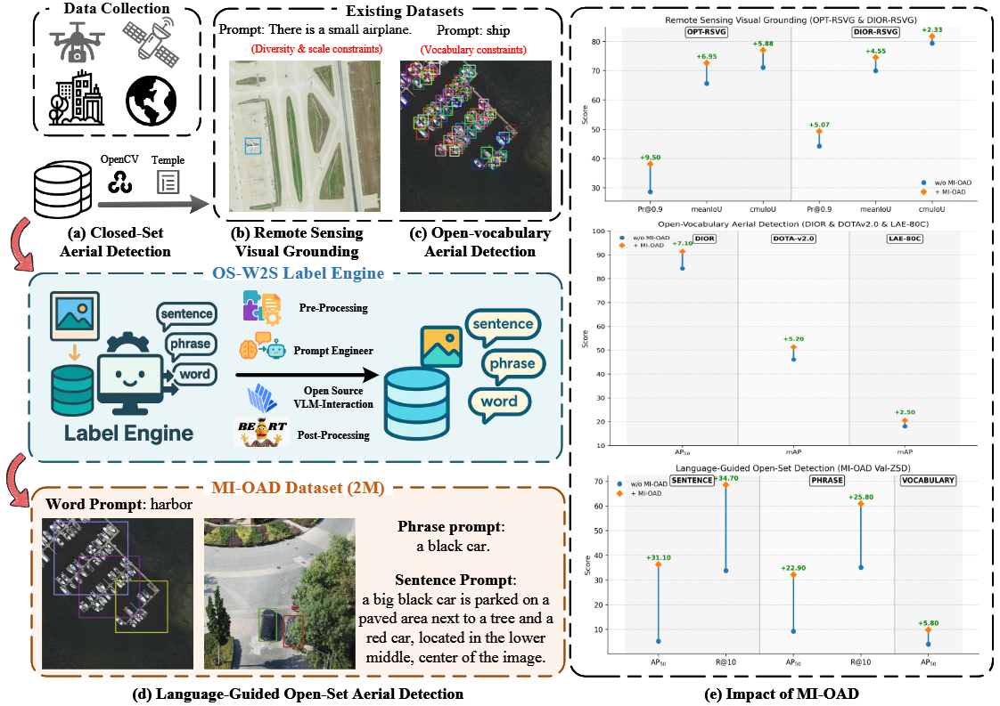
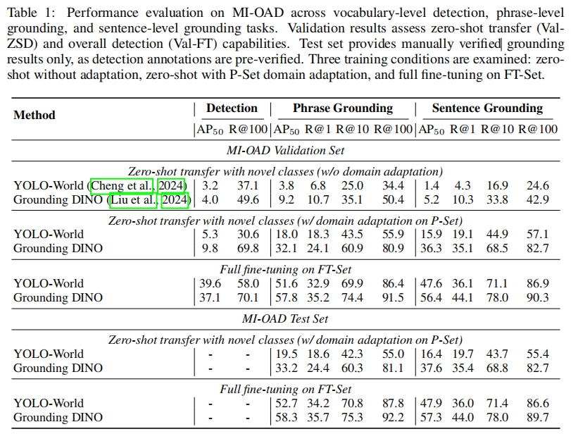
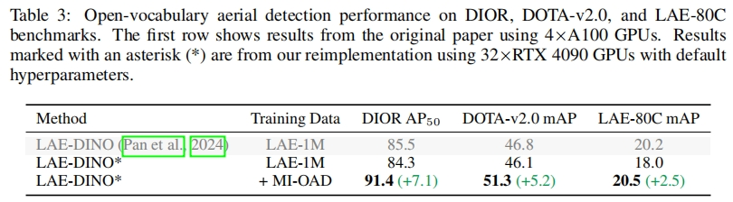
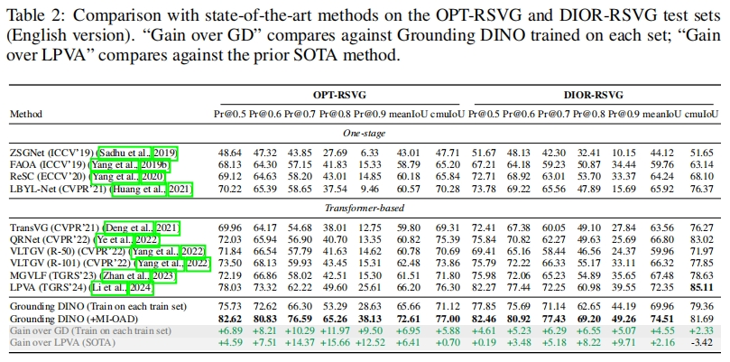

<!-- Header -->
<div align="center">
  
  
</div>

<h1 align="center">🛩️ OS-W2S: An Automatic Labeling Engine for Language-Guided Open-Set Aerial Object Detection</h1>

<div align="center">
  <strong>OS-W2S Label Engine:</strong> Open-Set Word-to-Sentence Label Engine<br/>
  <strong>MI-OAD:</strong> Multi-Instance Open-Set Aerial Dataset
</div>

<br/>

<div align="center">
  <!-- <a href="https://arxiv.org/pdf/2505.03334">
    
  </a> -->
  <a href="https://kaggle.com/datasets/070cdff2f649a10895c6fa09a45a58d00982afd8a8ba573696f521edd59cc028">
    
  </a>
  <a href="#-getting-started">
    
  </a>
  <a href="#-citation">
    
  </a>
  <a href="https://github.com/GT-Wei/MI-OAD">
    
</a>
  </a>
</div>

<div align="center">
  <sub>⭐️ If you find this project useful, please give it a Star </sub>
</div>

---

## 📢 Latest News

> **🎉 [Sep 28, 2025]** MI-OAD dataset is now publicly available! 
> 
> **[📥 Download from Kaggle](https://kaggle.com/datasets/070cdff2f649a10895c6fa09a45a58d00982afd8a8ba573696f521edd59cc028)** 
> 
> 📊 **163,023 images** | 🏷️ **2M image-caption pairs** | 🎯 **Language-guided open-set aerial detection**

---

## 📋 Todo List

- [x] 🎯 Release MI-OAD dataset (sampled datasets 2M+ captions)
- [ ] 📦 Release original annotation data (8M+ captions)
- [ ] 🔧 Release OS-W2S Label Engine Pipeline Code
- [ ] 📚 Enhance code readability and documentation
- [x] 🎯 Build strict zero-shot evaluation benchmark (Base/Novel category split)
- [ ] 🚀 Non-strict zero-shot evaluation benchmark (large-scale pre-training, no fine-tuning)
- [ ] 🧪 Test more existing models
- [ ] ⚖️ Upload model weights for all frameworks
- [ ] 🌟 Enhance data diversity and build larger MI-OADv2 dataset


## 🎨 Overview

<div align="center">
  
  <p><em>Figure 1: OS-W2S Label Engine and MI-OAD Dataset Construction for Language-Guided Open-Set Aerial Detection. <strong>Left:</strong> The OS-W2S Label Engine pipeline automatically expands existing aerial detection datasets with multi-granularity textual captions ranging from words to sentences, enabling the construction of MI-OAD. Unlike existing tasks, language-guided open-set aerial detection supports multi-granularity language guidance (word, phrase, and sentence levels), making it more aligned with real-world application requirements. <strong>Right:</strong> Performance improvements achieved by MI-OAD across three representative aerial detection tasks: Remote Sensing Visual Grounding, Open-Vocabulary Aerial Detection, and Language-Guided Open-Set Detection, showing substantial gains over baselines without MI-OAD.</em></p>
</div>

## ✨ Abstract

<details>
<summary><strong>🔍 Click to expand abstract</strong></summary>

In recent years, **language-guided open-set aerial object detection** has gained significant attention due to its better alignment with real-world application needs. However, due to limited datasets, most existing language-guided methods primarily focus on vocabulary-level descriptions, which fail to meet the demands of fine-grained open-world detection. 

To address this limitation, we propose constructing a large-scale language-guided open-set aerial detection dataset, encompassing **three levels of language guidance**: from words to phrases, and ultimately to sentences. 

Centered around an open-source large vision-language model and integrating image-operation-based preprocessing with BERT-based postprocessing, we present the **OS-W2S Label Engine**, an automatic annotation pipeline capable of handling diverse scene annotations for aerial images. 

Using this label engine, we expand existing aerial detection datasets with rich textual annotations and construct a novel benchmark dataset, called **Multi-instance Open-set Aerial Dataset (MI-OAD)**, addressing the limitations of current remote sensing grounding data and enabling effective language-guided open-set aerial detection.

### 📈 Key Statistics
- **163,023 images** and **2 million image-caption pairs**
- **Multiple instances per caption**
- **~40x larger** than comparable datasets

### 🏆 Performance Highlights
- **+31.1 AP₅₀** improvement with Grounding DINO
- **+34.7 Recall@10** under zero-shot transfer
- **State-of-the-art** performance on OVAD and RSVG benchmarks

</details>

---

## 🔗 Quick Navigation

<table>
<tr>
<td width="50%">

### 🛠️ **Setup & Installation**
- [📦 Installation Guide](#️-installation)
- [🚀 Getting Started](#-getting-started)
- [📁 Dataset Structure](#-dataset-structure)

</td>
<td width="50%">

### 📚 **Resources & Links**
- [MMDetection Guide](https://mmdetection.readthedocs.io/zh-cn/latest/get_started.html)
- [YOLO-World Repository](https://github.com/AILab-CVC/YOLO-World)
- [📋 Todo List](#-todo-list)

</td>
</tr>
</table>

---

## ⚙️ Installation

> 💡 **Tip:** For complete installation details, follow the official documentation links above.

### 🔧 Setup Instructions

<details>
<summary><strong>📦 MMDetection Setup</strong></summary>

```bash
# 1. Create environment
conda create -n openmm python=3.10 -y
conda activate openmm

# 2. Install MMDetection 3.3.0
pip install openmim
mim install "mmcv>=2.0.0"

# 3. Clone and install
cd mmdetection && git checkout v3.3.0
pip install fairscale transformers
pip install -e .
cd ..
```
</details>

<details>
<summary><strong>🎯YOLO-World Setup</strong></summary>

```bash
# 1. Create environment
conda create -n yolo-world python=3.9 -y
conda activate yolo-world

# 2. Install YOLO-World
cd YOLO-World
pip install -r requirements.txt
pip install -e .
```
</details>

---

## 🚀 Getting Started

### 🏃‍♂️ Quick Start

Choose your preferred framework:

```bash
# 🔥 MMDetection Training
bash mmdetection/tools/MIOAD_Pretrain.sh

# 🎯 YOLO-World Training  
bash YOLO-World/tools/MIOAD_Pretrain.sh
```

### 📊 Configuration Files

| Framework | Config Path |
|-----------|-------------|
| **MMDetection** | `mmdetection/projects/MI-OAD` |
| **YOLO-World** | `YOLO-World_RSSD/configs/MI-OAD` |

---

## 📁 Dataset Structure

```
🗂️ MI-OAD/
├──  images/              # Raw aerial images
├──  Caption/             # Text annotations
├──  Detection/           # Detection annotations
└──  datasets_categories_list/  # Category definitions
```

### 📥 Download Options

<div align="center">

| Platform | Link |
|----------|------|
| **Kaggle** | [🔗 Download](https://kaggle.com/datasets/070cdff2f649a10895c6fa09a45a58d00982afd8a8ba573696f521edd59cc028) |
| **Google Drive** | 🔄 Coming Soon | 
| **Hugging Face** | 🔄 Coming Soon | 

</div>

---

## 📊 Benchmarks & Results

<details>
<summary><strong>🏆Performance Comparison</strong></summary>

> 📊 **Note:** The authors are building more comprehensive benchmark results. Please stay tuned for detailed performance metrics!

### Language-Guided Open-Set Aerial Detection
<div align="center">
  
</div>

### Open-Vocabulary Aerial Detection (OVAD)
<div align="center">
  
</div>

### Remote Sensing Visual Grounding (RSVG)
<div align="center">
  
</div>
</details>

---
### 🐛 Issues & Support
- [🐛 Report Bug](https://github.com/GT-Wei/MI-OAD/issues)
- [💡 Request Feature](https://github.com/GT-Wei/MI-OAD/issues)

---

## 📝 Citation

If you find this work useful, please consider citing:

```bibtex
@article{osw2s2025,
  title={OS-W2S: An Automatic Labeling Engine for Language-Guided Open-Set Aerial Object Detection},
  author={Coming Soon},
  journal={Coming Soon},
  year={2025}
}
```

---

## 🙏 Acknowledgments

- Thanks to the [MMDetection](https://github.com/open-mmlab/mmdetection) team
- Thanks to the [YOLO-World](https://github.com/AILab-CVC/YOLO-World) contributors
- Special thanks to all dataset contributors and annotators

---

<div align="center">
  <strong>Made with ❤️ for the aerial detection community</strong><br/>
  <sub>⭐ Star us on GitHub — it motivates us a lot!</sub>
</div>
